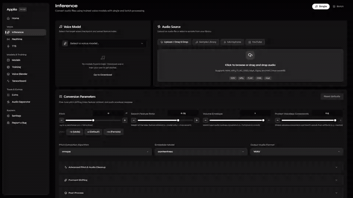

<h1 align="center">
  <a href="https://applio.org" target="_blank"></a>
</h1>

<p align="center">
    
    
    
    
    
</p>

<p align="center">A desktop-first, high-quality voice conversion studio built on Applio — convert voices, train models, and synthesize speech from one app.</p>

<p align="center">
  <a href="https://applio.org" target="_blank">🌐 Website</a>
  •
  <a href="https://docs.applio.org" target="_blank">📚 Documentation</a>
  •
  <a href="https://discord.gg/wY7gmqTyEV" target="_blank">☎️ Discord</a>
</p>

<p align="center">
  <a href="https://github.com/IAHispano/Applio-Plugins" target="_blank">🛒 Plugins</a>
  •
  <a href="https://huggingface.co/IAHispano/Applio/tree/main/Compiled" target="_blank">📦 Compiled</a>
  •
  <a href="https://applio.org/playground" target="_blank">🎮 Playground</a>
  •
  <a href="https://colab.research.google.com/github/IAHispano/Applio-app/blob/main/assets/Applio.ipynb" target="_blank">🔎 Google Colab</a>
  •
  <a href="https://github.com/IAHispano/Applio-app/blob/main/assets/Applio_Kaggle.ipynb" target="_blank">🦅 Kaggle</a>
  •
  <a href="https://colab.research.google.com/github/IAHispano/Applio-app/blob/main/assets/Applio_NoUI.ipynb" target="_blank">💻 Colab (No UI)</a>
</p>

<p align="center">
  
</p>
<p align="center">
  <em>🎬 Applio Studio walkthrough showcase (<a href="assets/demo.mp4?raw=true">Watch MP4</a> • <a href="assets/demo.webm?raw=true">WebM</a>)</em>
</p>

## Introduction

Applio App is a voice conversion studio focused on simplicity, quality, and performance. Whether you're an artist, developer, or researcher, it gives you a single desktop app for high-quality voice transformations, model training, and speech synthesis — with a plugin system for extending it to your own projects.

## Getting Started

### Free Cloud Runtimes (Google Colab & Kaggle)

Run Applio online for free using cloud GPUs without installing anything locally:
- **[Google Colab](./assets/Applio.ipynb)**: One-click setup with Nvidia T4 GPU, persistent Google Drive model synchronization, and free automatic Cloudflare tunneling (no account or token required).
- **[Kaggle Notebook](./assets/Applio_Kaggle.ipynb)**: Free T4 x2 / P100 GPU with automatic Cloudflare tunneling (ensure *Settings ➔ Internet: ON* in Kaggle notebook settings).

### Recommended: desktop installer

1. Download the installer for your OS from the [releases page](https://github.com/IAHispano/Applio-app/releases) (`Applio-<version>-Windows-Setup.exe`, `Applio-<version>-macOS.dmg`, or `Applio-<version>-Linux.AppImage` / `.deb`) and run it.
2. Launch **Applio**. On first launch the setup screen checks every dependency — press **Install / Repair** and wait.
3. Every later launch re-runs the checks, so a broken environment is caught before you hit Convert.

> [!WARNING]
> **macOS first launch:** the app is not Apple-notarized yet, so Gatekeeper may claim Applio "is damaged".
> It isn't — clear the download quarantine and open it again:
> ```bash
> xattr -cr /Applications/Applio.app
> ```
> On Apple Silicon the app runs via PyTorch MPS with CPU fallback enabled automatically.

### Developers (any OS)

Prerequisites: Python 3.10–3.12, Node.js 22+, `pnpm@11`, ffmpeg.

```bash
pnpm install
pnpm dev          # API :8000 + web :3000 with hot reload
# open http://localhost:3000/  (setup screen)

pnpm desktop:dev  # full Electron shell instead of just the browser UI
```

First run: open the app, press **Install / Repair** on the setup screen (creates `.venv`, installs torch + requirements, builds the UI).

### Scripts

| Command | What it does |
| --- | --- |
| `pnpm dev` | API + web with hot reload |
| `pnpm desktop:dev` | API + web + Electron shell |
| `pnpm build` | Production build of API + web |
| `pnpm build:win` / `build:mac` / `build:linux` | Full build + platform installer (lands in `app/desktop/dist-installers/`) |
| `pnpm typecheck` | TypeScript checks across all packages |
| `pnpm test` | Smoke test suite |
| `pnpm format` | Format/lint-fix `app` + `tests` with Biome |


## Terms of Use and Commercial Usage

Using Applio responsibly is essential.

- Users must respect copyrights, intellectual property, and privacy rights.
- Applio is intended for lawful and ethical purposes, including personal, academic, and investigative projects.
- Commercial usage is permitted, provided users adhere to legal and ethical guidelines, secure appropriate rights and permissions, and comply with the [MIT license](./LICENSE).

The source code and model weights in this repository are licensed under the permissive [MIT license](./LICENSE), allowing modification, redistribution, and commercial use.

However, if you choose to use this official version of Applio (as provided in this repository, without significant modification), you must also comply with our [Terms of Use](./TERMS_OF_USE.md). These terms apply to our integrations, configurations, and default project behavior, and are intended to ensure responsible and ethical use without limiting their use in any way.

For commercial use, we recommend contacting us at [support@applio.org](mailto:support@applio.org) to ensure your usage aligns with ethical standards. All audio generated with Applio must comply with applicable copyright laws. If you find Applio helpful, consider supporting its development [through a donation](https://ko-fi.com/iahispano).

By using the official version of Applio, you accept full responsibility for complying with both the MIT license and our Terms of Use. Applio and its contributors are not liable for misuse. For full legal details, see the [Terms of Use](./TERMS_OF_USE.md).

## References

Applio is made possible thanks to these projects and their references:

- [gradio-screen-recorder](https://huggingface.co/spaces/gstaff/gradio-screen-recorder) by gstaff
- [rvc-cli](https://github.com/blaisewf/rvc-cli) by blaisewf

### Contributors
<a href="https://github.com/IAHispano/Applio-app/graphs/contributors" target="_blank">

  
</a>
